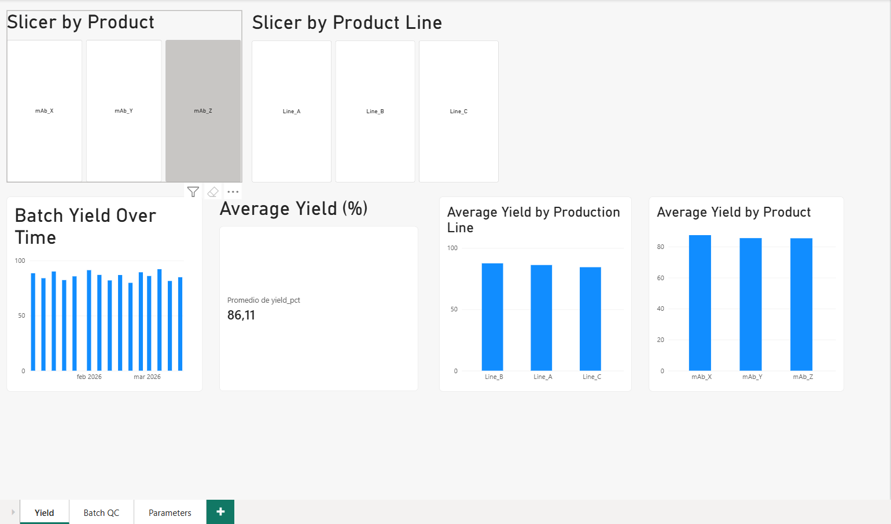
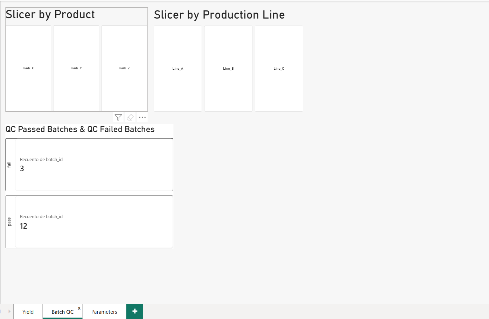
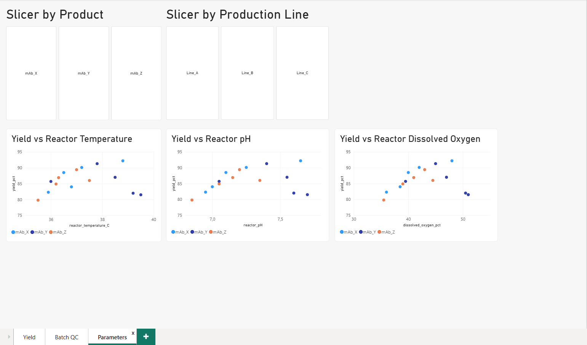

# Biopharmaceutical Manufacturing Analytics

This project is a data analysis that uses Python and Power BI to analyse simulated biopharmaceutical manufacturing batch data.

The project evaluates production yield, process conditions and quality-control results through a reproducible workflow and an interactive Power BI dashboard.

> **Note:** The dataset used in this project is synthetic and was created exclusively for educational and portfolio purposes. It does not contain real company or patient data.

## Dashboard Preview

### Biopharmaceutical Manufacturing Yield Dashboard

### Biopharmaceutical Manufacturing QC Dashboard

### Biopharmaceutical Manufacturing Parameters Dashboard

## Project Objective

A biopharmaceutical manufacturing process produces multiple batches under different operating conditions. Each batch contains process information, production results and quality-control outcomes.

The objective of this project is to analyse batch data and answer the following questions:

- What is the average production yield?
- Which batches have low yield?
- How does yield change over time?
- Do yield results differ by product or production line?
- Are temperature, pH or dissolved oxygen values outside their expected ranges?
- Are process conditions associated with production yield?
- How many batches pass or fail the quality-control checks?

## Dataset

The synthetic dataset contains 15 manufacturing batches and includes the following categories of information:

### Batch information

- `batch_id`
- `product_name`
- `production_line`
- `start_date`
- `end_date`
- `shift`

### Process parameters

- `reactor_temperature_C`
- `reactor_pH`
- `dissolved_oxygen_pct`
- `agitation_rpm`
- `feed_rate_L_h`

### Production performance

- `biomass_concentration_g_L`
- `product_concentration_g_L`
- `yield_pct`

### Quality-control results

- `qc_purity_pct`
- `qc_potency_pct`
- `qc_contaminants_flag`
- `overall_qc_result`

## Data Analysis

Python and pandas were used to perform the following tasks:

- Load and inspect the manufacturing dataset.
- Check column types and missing values.
- Convert production dates to datetime format.
- Calculate average, minimum and maximum yield.
- Identify batches with yield below the defined threshold.
- Calculate QC pass and fail counts.
- Calculate the overall QC pass rate.
- Compare average yield by product and production line.
- Flag temperature, pH and dissolved oxygen values outside defined operating ranges.
- Create manufacturing performance visualisations.
- Export a cleaned CSV file for Power BI.

## Key Performance Indicators

The analysis produced the following main KPIs:

- **Total batches:** 15
- **Average batch yield:** 86.11%
- **QC passed batches:** 12
- **QC failed batches:** 3
- **QC pass rate:** 80%

## Power BI Dashboard

The Power BI dashboard includes:

- Average yield KPI.
- QC passed and failed batch counts.
- Batch yield over time.
- Average yield by product.
- Average yield by production line.
- Yield versus reactor temperature.
- Yield versus reactor pH.
- Yield versus reactor dissolved oxygen.
- Product slicer.
- Production-line slicer.

The slicers allow users to investigate manufacturing performance for individual products and production lines.

## Main Insights

- The overall average production yield was approximately 86.11%.
- Twelve of the fifteen batches passed the overall QC assessment.
- Three batches failed the overall QC assessment.
- Production yield varied between batches, products and production lines.
- The process-parameter scatter plots make it possible to explore whether reactor temperature or pH is associated with yield.
- Low-yield and failed batches can be investigated individually using the dashboard filters.

## Technologies

- Python
- pandas
- matplotlib
- Jupyter Notebook
- Power BI
- Visual Studio Code

## Limitations

- The dataset is synthetic and does not represent an actual pharmaceutical manufacturing process.
- The dataset contains only 15 batches.
- Operating ranges were defined for demonstration and are not validated manufacturing specifications.
- The project is intended to demonstrate a data-analysis workflow rather than support real batch-release decisions.

## Author

**Angel HK**  
Biotechnology Engineering student interested in bioprocessing, manufacturing analytics and scientific data analysis.
